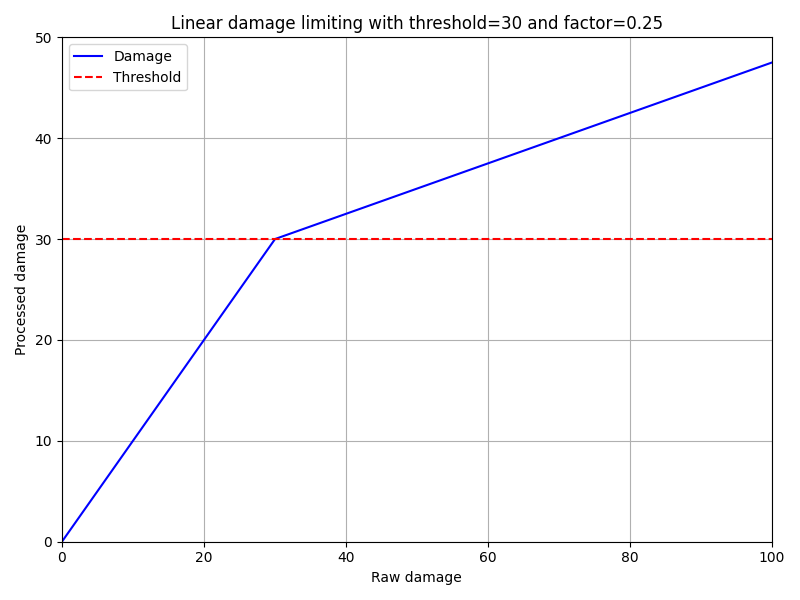
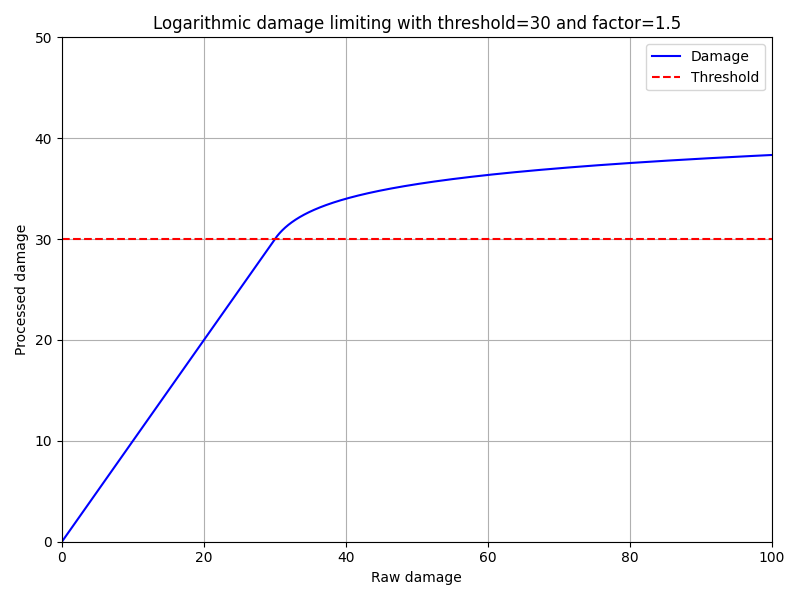

# DamageLimit
Limit the player's damage

## Usage:
- Put the jar file into the "plugins" folder, load the plugin or restart the server
- Edit config.yml to configure the plugin to your needs
- Reload the plugin or restart the server apply the changes

## Config:
- See [config.yml](https://github.com/MSUPlugins/DamageLimit/blob/master/src/main/resources/config.yml)

## Limiting the damage
There are two limiting algorithms available: **linear** and **logarithmic**.
You can configure which algorithm to let DamageLimit use in **config.yml**,
as well as see the parameter requirements for each algorithm.
The charts below show the characteristics of each algorithm.
### Linear limitation

### Logarithmic limitation

